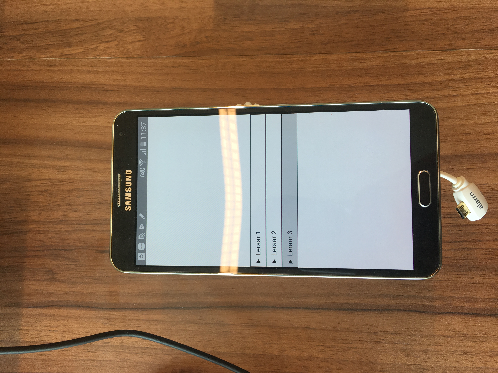
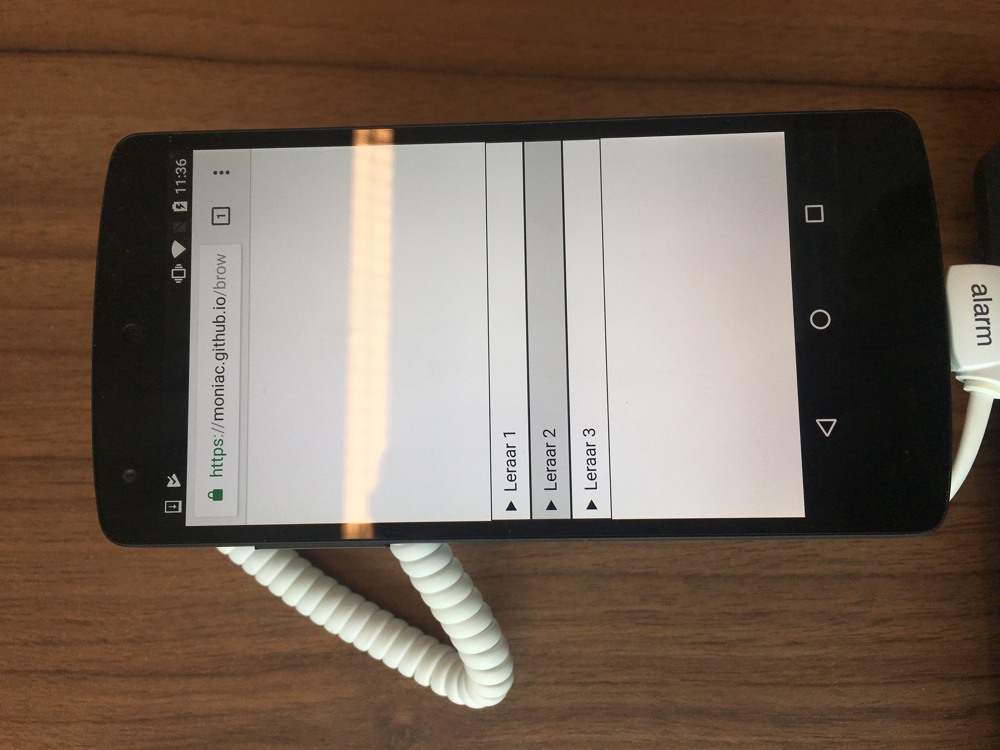
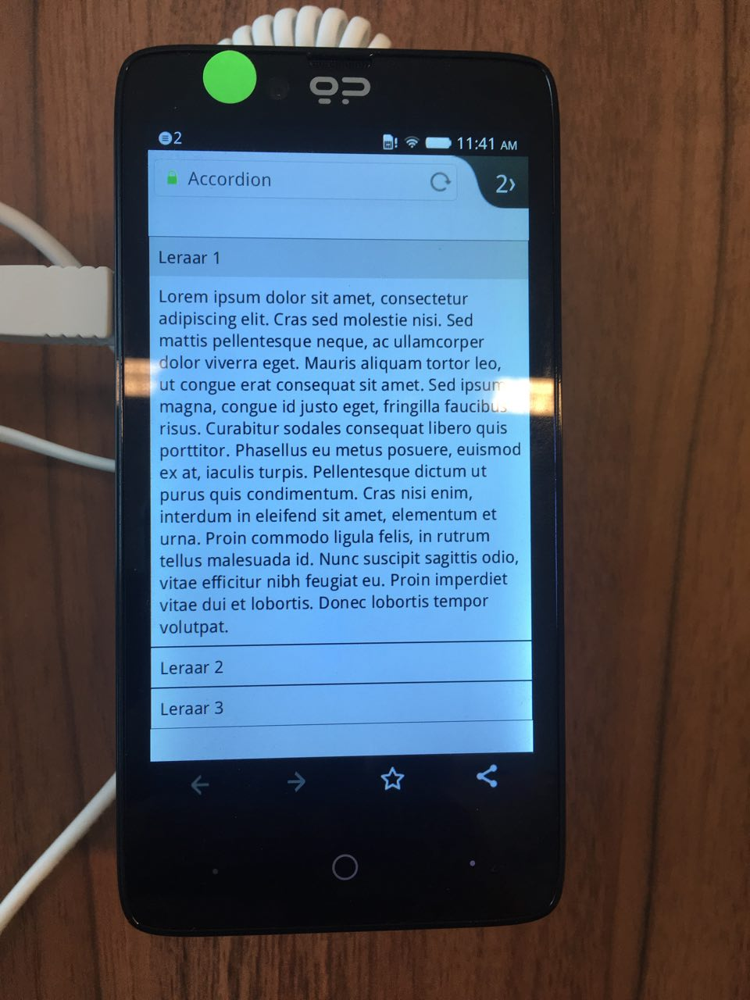

# Browser Technologies
//Robuuste, toegankelijke websites leren bouwen …

Accordeon
https://moniac.github.io/browser-technologies/opdracht2/accordeon/index.html

Image Picker
https://moniac.github.io/browser-technologies/opdracht2/imagepicker/index.html


## Accordeon

Voor dit element heb ik gebruik gemaakt van het ```details``` en ```summary``` element.

Dit is een relatief nieuwe feature die een accordeon nabootst. Het heeft een fijne [fallback](https://css-tricks.com/quick-reminder-that-details-summary-is-the-easiest-way-ever-to-make-an-accordion/) in de zin van dat als je geen ondersteuning ervoor hebt het element standaard al uitgeklapt is.

Het bespaart veel werk omdat je niet met javascript een menu hoeft uit te laten klappen.

## Browser support

Chrome | Internet Explorer | Firefox | Safari | Opera
---------|----------|--------- | ------- | -----
 ✅ |  🚫  |  ✅ |  ✅  | 🚫

 --------------------

 ## Fallback Support

 Hiermee check ik of de browser het detail element correct ondersteund. Daarnaast check ik ook of de querySelectorAll en de classList correct ondersteund worden, om zo de functionaliteit toe te voegen mocht het details element niet ondersteund worden.

 ```js
if (!("open" in document.createElement("details")) 
&& document.querySelectorAll && document.createElement("_").classList)
```

### De code

```js
if (!("open" in document.createElement("details")) && document.querySelectorAll && document.createElement("_").classList)
			for (var accordeonTitle = document.querySelectorAll(".title"), i = 0; i < accordeonTitle.length; i++)
				accordeonTitle[i].parentNode.childNodes[3].classList.add("hide"), accordeonTitle[i].addEventListener("click",
					function () {
						this.parentNode.childNodes[3].classList.toggle("hide")
					});
```

Wat hier gebeurt is dat de code alleen werkt als details niet ondersteund wordt. Mocht het niet ondersteund worden, dan wordt er een css class toegevoegd om de text standaard te verbergen. Daarna kan de gebruiker klikken op de titel en zal de text wel getoond worden.

## Devicelab

<details>





</details>


## Image Picker

Hiermee kan iemand een afbeelding uploaden en krijgen ze de afbeelding als preview te zien.

## Browser support


Chrome | Internet Explorer | Firefox | Safari | Opera
---------|----------|--------- | ------- | -----
 ✅ |  🚫  |  ✅ |  🚫  | ✅ 