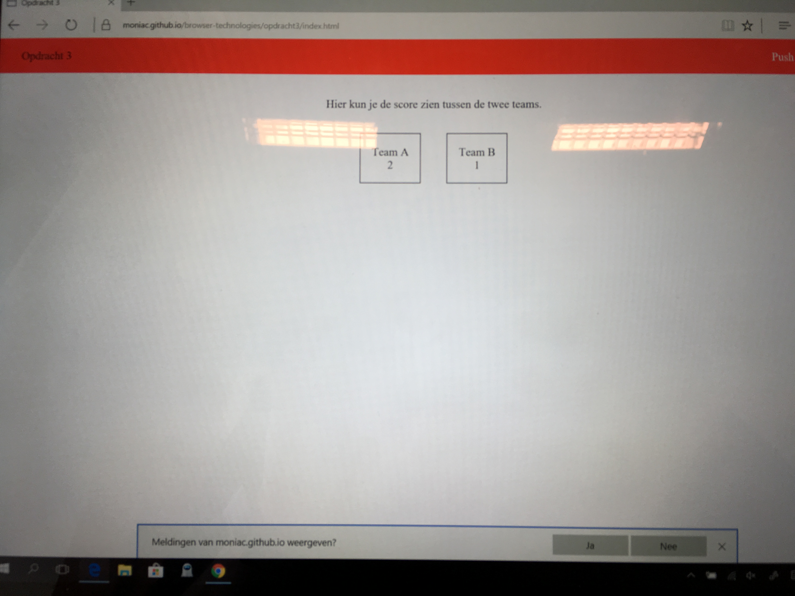
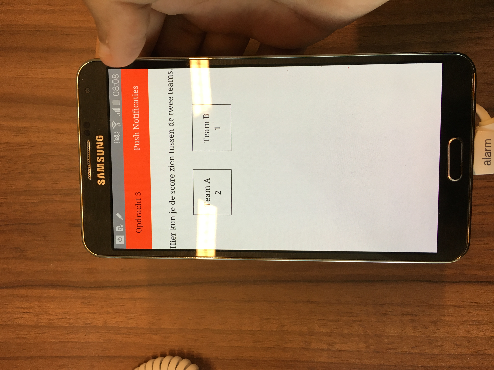
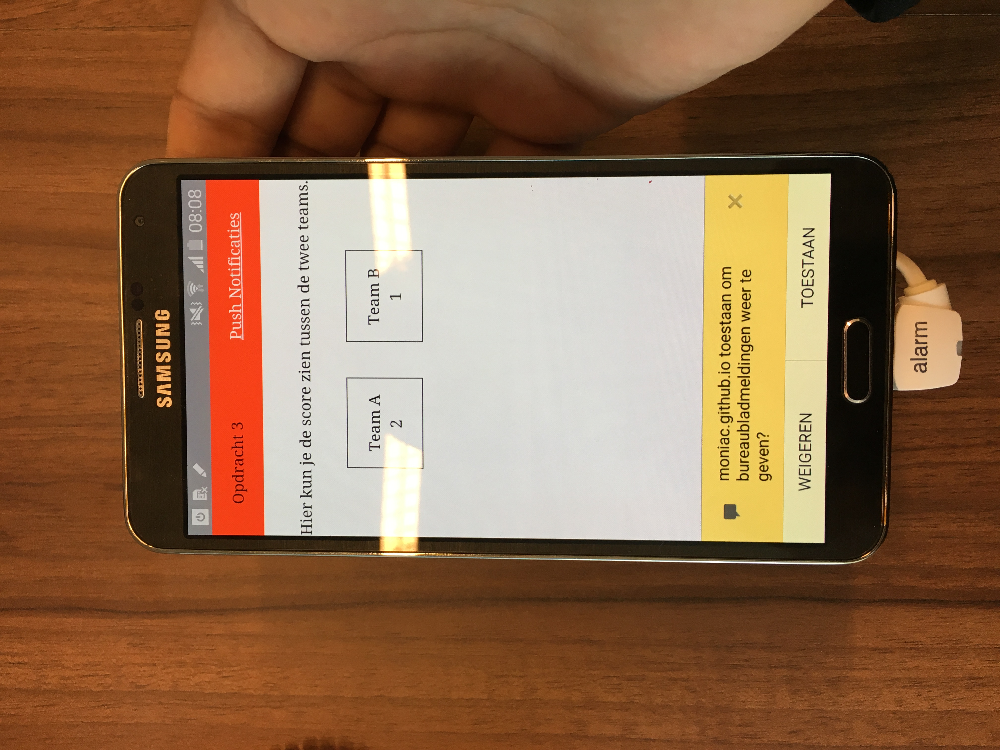
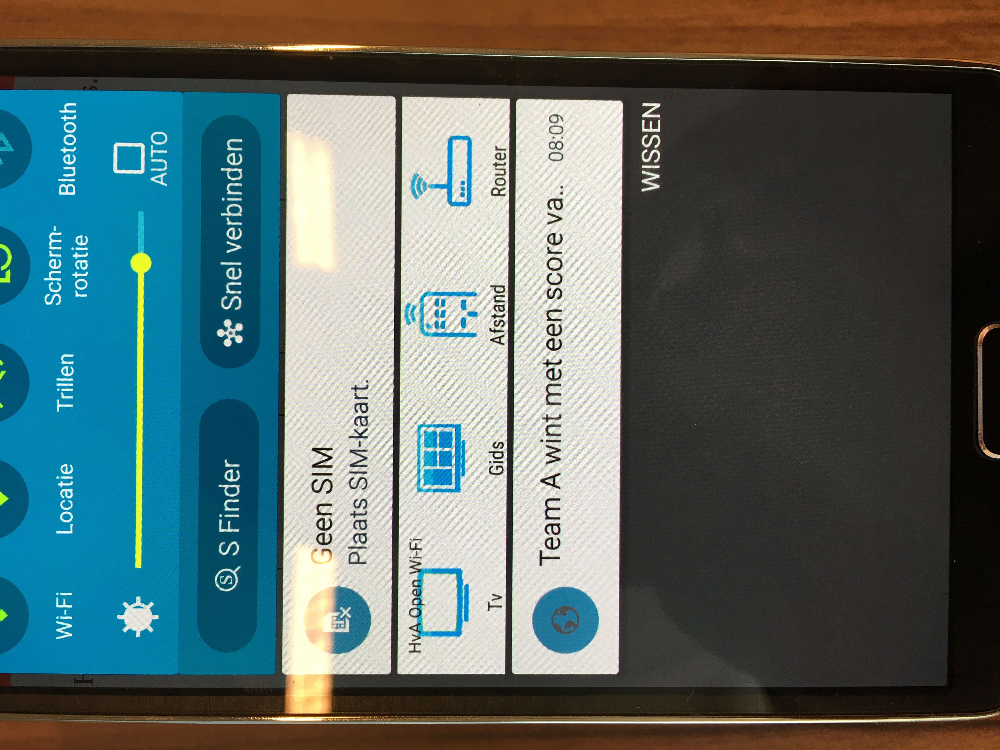
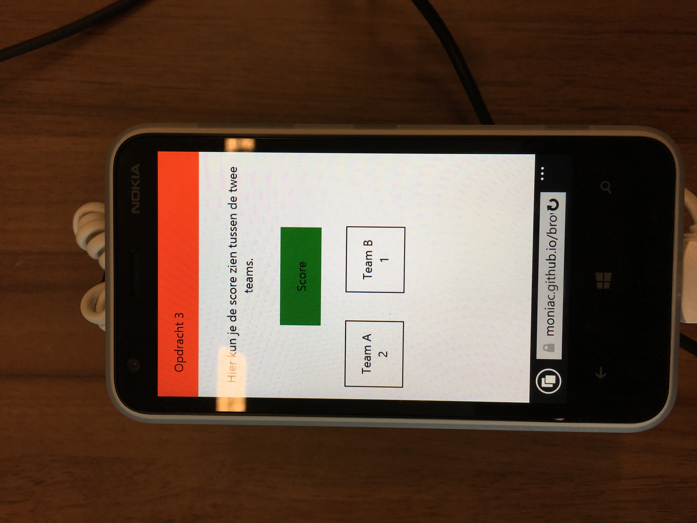
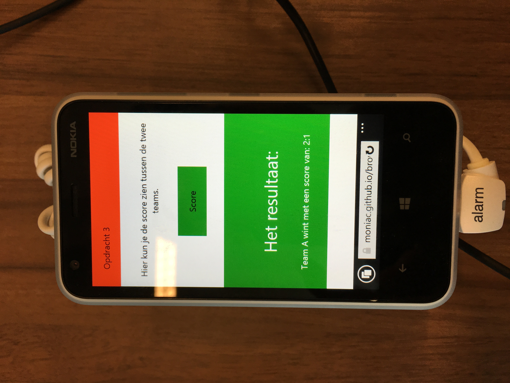

## Opdracht 3

[Website hier](https://moniac.github.io/browser-technologies/opdracht3/index.html)

Feedback | Done |
---------|----------
 push.min.js weghalen (vanilla way) | ✅ 
 Geen notificaties tegelijk doen | ✅
 User flow verwerken | ✅

# Browser Technologies
//Robuuste, toegankelijke websites leren bouwen …

## Progressive Enhancement

Het doel van progressive enhancement is om vanuit een solide basis steeds meer 'nice' stuff toe te voegen.

Het is dus belangrijk dat een website altijd kan werken zonder de fancy stuff.

## Kleur

Voor dit project heb ik super lelijke kleuren gebruikt, alhoewel ik dat jammer vind is het toch wel fijn dat dit nu voor de meeste mensen goed zichtbaar is.

De tool heb ik gedownload sinds ik het in een presentatie van Ischa Gast zag.


## Core functionality

* Het kunnen weergeven van de uitslag van een wedstrijd. De gebruiker wilt iets van een notificatie kunnen ontvangen wanneer een team wint.

* De meeste interessante gebruikte technologie hier zijn de push notificaties.

* De simpelste opzet is puur HTML, waarbij slechts het resultaat weergeven wordt.

## Ondersteuning


Zoals je kunt zien valt de ondersteuning voor de notification API nog best tegen. Niet alle browsers ondersteunen het momenteel maar zijn er wel mee bezig.

Het is dus belangrijk dat de Notificatie vrijblijvend is en niet de core functionality van je website.

## Enhanced

---

Momenteel bouwt de website zich in 3 stappen op, beginnend bij puur HTML.

Stap 1: 

```js
if ('Notification' in window && Notification.permission == 'denied')
```

```js
else if ('Notification' in window)
```

Check of de nieuwe Notification API beschikbaar is voor de browser. Is die aanwezig? Mooi, dan gebruiken we die. 

Is die er, maar heeft iemand gekozen om dit te blokkeren? Het is namelijk goed mogelijk dat Notificaties compleet gefaald zijn en dat mensen het standaard zullen blokkeren. Als ik dit niet doe dan zullen die mensen alleen een button zien die dus niks doet. Laat dan stap 2 zien.

Stap 2:

```js
else if ("querySelector" in document)
```

Geen Notification? No problem, we doen het met een simpele classList toggle, waarbij een HTML element weergeven en verborgen wordt.

Stap 3:

```js
else if ("alert" in window)
```

Geen Notification en geen querySelector? Dan doen we een simpele alert()

---

## Device Lab

<details>

Notifications supported

Microsoft Surface

Microsoft Surface - 2

Microsoft Surface - 3


Samsung




Geen Notification support





</details>