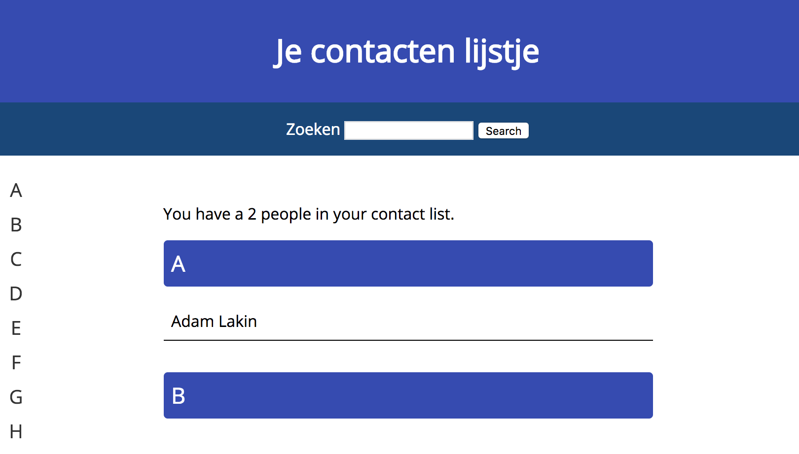
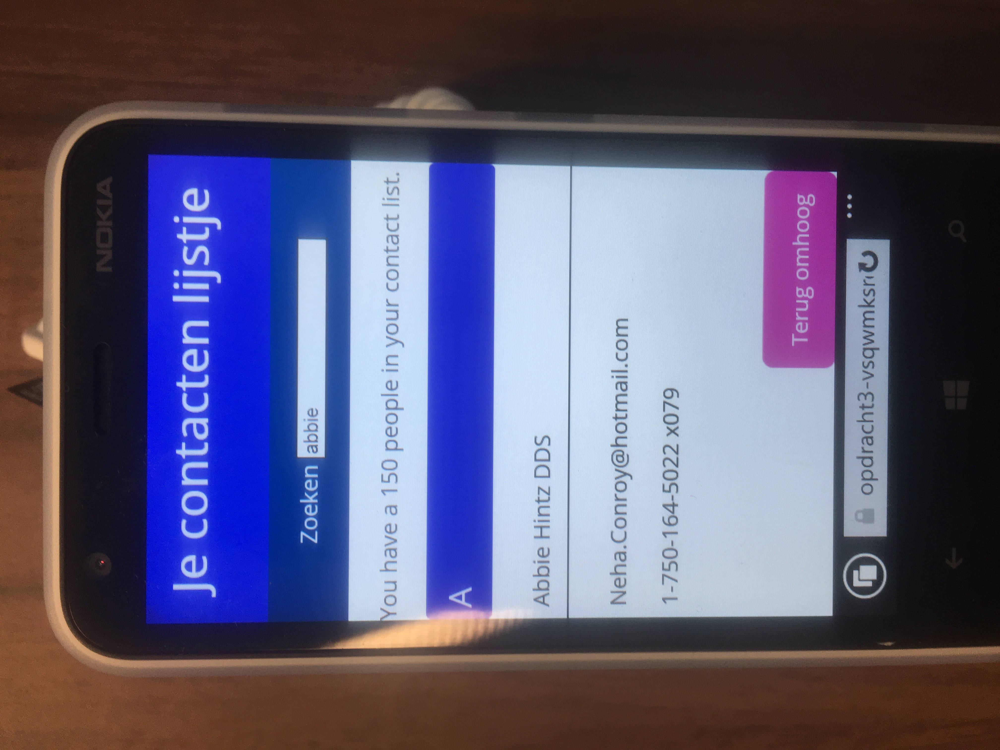

## Opdracht 3

[Website hier](https://opdracht3-maeokkmrkd.now.sh)

Feedback | Done |
---------|----------
Teveel, met andere case begonnen | ✅ 

# Browser Technologies
//Robuuste, toegankelijke websites leren bouwen …

## Progressive Enhancement

Het doel van progressive enhancement is om vanuit een solide basis steeds meer 'nice' stuff toe te voegen.

Het is dus belangrijk dat een website altijd kan werken zonder de fancy stuff. Zo zorg je ervoor dat alles en iedereen je website kan gebruiken en het alleen maar beter kan worden.

## Kleuren

Voor dit project heb ik gebruikt gemaakt van [Color Safe.](http://colorsafe.co/)


Color safe is een website waar je gemakkelijk kleuren kan vinden die een goed contrast bieden.


## Core functionality

* Het kunnen zien van een lijst van contacten

* Kunnen filteren op naam van een contact

* Simpel en snel kunnen navigeren door je contactenlijst

## Baseline

Voor dit project heb ik gebruik gemaakt voor een back-end om als fallback te dienen voor degenen die geen Javascript hebben maar wel details willen zien.


Zoals je kunt zien is er een input met een knop, dit is alleen zichtbaar voor wie geen javascript heeft.

---



Door te typen komt een page refresh en zie je het resultaat

---


Door te klikken op een naam wordt je naar een detail pagina gebracht

---

## Enhanced

Ik maak de website een stuk sneller en makkelijker voor wie wel Javascript heeft. Ik heb een simpele check op addEventListener en querySelector, omdat ik vind dat het genoeg support heeft en dat de basis functionaliteit die ik aanbied genoeg is voor de andere mensen.


Zoals je kunt zien gaat het om een kleine 2.55% die niet de dingen ondersteund zoals ik het wil aanbieden.

---

### Realtime filter


Er zit een no-js op de html tag, die standaard een knop doet weergeven in de form onder de header. Wanneer je javascript hebt wordt deze class weggehaald en dus de button ook. Dan kan er gewoon direct gefiltered worden op een contact zonder de pagina te refreshen.

### Details inline

Als je Javascript het ondersteund, wordt er op iedere contact een event listener toegevoegd, waarbij je on click een ```xtmlhttprequest``` doet naar mijn api op de backend.


Het resultaat hiervan wordt onder de betreffende contact weergeven zonder de pagina te refreshen.

Mischien denk je, waarom test je niet op xmtlhttprequest support? Omdat als querySelector of addEventListener niet support wordt, de xmtlhttprequest ook nooit toegevoegd kan worden ;)

Daarnaast worden de basic features van xmtlhttprequest uitstekend ondersteund.

### Smooth scroll

Op tablet formaat wordt een navigatie zichtbaar gemaakt waar de gebruiker doorheen kan tabben of klikken. Het klikken hierop zorgt voor een smooth scroll animatie naar het juiste blok mits je ```scroll-behaviour: smooth;``` ondersteund.


Als je het niet ondersteunt heb je wel de werking, alleen geen mooie animatie.

### Scroll to top

Als je vanaf de bovenkant van de website 200px naar beneden scrolled, komt er een knop in beeld die je makkelijk terug naar boven laat scrollen. Zonder Javascript staat de button gewoon onderaan de pagina.


## Device Lab

<details>

Microsoft Surface

Microsoft Surface - 2

Microsoft Surface - 3





</details>